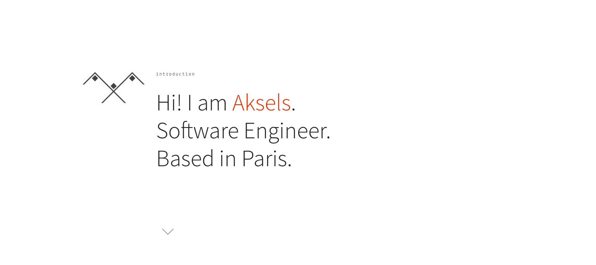
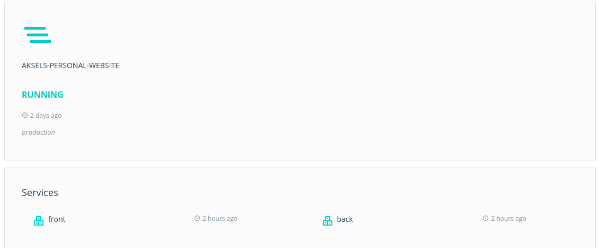

# aksels.me

Source of [aksels.me](http://aksels.me)

## stack

React + Docker

## improvements, what's next

- on client:
  - unit test
  - get rid off the last lines of jquery
  - get rid off the .css public files
- on api:
  - unit test
  - refactor everything
- both:
  - eslint :cold_sweat:
  - clean repo
  - write a real readme

 
 
 
 
 
 
 
 
 
 
 

## This is completely overkill !
> (aksels): True
